# Dashboard Sequence Diagram

## Sequence Diagram สำหรับหน้า Dashboard ของระบบ Eventra Management System

```mermaid
sequenceDiagram
    participant User as ผู้ใช้
    participant Vue as Dashboard Component (Vue)
    participant API as Laravel API
    participant DB as ฐานข้อมูล MySQL
    participant Event as EventController
    participant Employee as EmployeeController
    
    Note over User, Employee: 1. การโหลดหน้า Dashboard เริ่มต้น
    
    User->>Vue: เข้าสู่หน้า Dashboard
    Vue->>Vue: created() lifecycle hook
    
    Note over Vue, DB: Parallel API Calls เมื่อโหลดหน้า
    
    par โหลดข้อมูล Events
        Vue->>API: GET /api/get-event
        API->>Event: Eventtable(request)
        Event->>DB: SELECT events + JOIN categories + subquery counts
        Note over Event, DB: ดึงข้อมูล Event พร้อม:<br/>- จำนวนผู้เข้าร่วม (ems_connect)<br/>- จำนวนผู้ตอบรับ<br/>- ข้อมูล Category
        DB-->>Event: Events data with statistics
        Event-->>API: JSON response
        API-->>Vue: Events array
    and โหลดข้อมูล Categories
        Vue->>API: GET /api/event-info
        API->>Event: eventInfo()
        Event->>DB: SELECT categories WHERE cat_delete_status='active'
        DB-->>Event: Categories data
        Event-->>API: Categories array
        API-->>Vue: Categories for filter
    and โหลดข้อมูล Employees
        Vue->>API: GET /api/get-employees
        API->>Employee: index()
        Employee->>DB: SELECT employees JOIN position, department, team
        Note over Employee, DB: ดึงข้อมูลพนักงาน พร้อม:<br/>- ตำแหน่ง (ems_position)<br/>- แผนก (ems_department)<br/>- ทีม (ems_team)
        DB-->>Employee: Employees with relations
        Employee-->>API: JSON response
        API-->>Vue: Employees array
    end
    
    Vue->>Vue: อัพเดตข้อมูลใน data()
    Vue->>User: แสดงตาราง Events
    
    Note over User, Employee: 2. การเลือก Event สำหรับ Dashboard
    
    User->>Vue: คลิกเลือก Event (radio button)
    Vue->>Vue: onEventSelect(event)
    Vue->>Vue: selectedEventId = event.id
    Vue->>Vue: loadEventStatistics(eventId)
    
    Vue->>API: GET /api/event/{eventId}/participants
    API->>Event: getEventParticipants(eventId)
    
    Event->>DB: Query statistics from ems_connect
    Note over Event, DB: SELECT COUNT statistics:<br/>- SUM(CASE WHEN con_answer = "accept")<br/>- SUM(CASE WHEN con_answer = "denied")<br/>- SUM(CASE WHEN con_answer = "invalid")<br/>WHERE con_event_id = eventId
    DB-->>Event: Statistics data
    
    Event->>DB: Query participants details
    Note over Event, DB: SELECT participants data:<br/>JOIN ems_connect + ems_employees<br/>+ ems_position + ems_department + ems_team<br/>WHERE con_event_id = eventId
    DB-->>Event: Participants with details
    
    Event-->>API: JSON with statistics & participants
    API-->>Vue: Event statistics data
    
    Vue->>Vue: อัพเดต chartData
    Vue->>User: แสดง Dashboard components
    Note over Vue, User: - DonutActualAttendance Chart<br/>- GraphEventParticipation Chart<br/>- Status Cards (Attending/NotAttending/Pending)
    
    Note over User, Employee: 3. การดูรายละเอียดพนักงานตาม Status
    
    User->>Vue: คลิก Status Card (Attending/NotAttending/Pending)
    Vue->>Vue: showEmployeesByStatus(status)
    Vue->>Vue: employeeTableType = status
    Vue->>Vue: showEmployeeTable = true
    
    Vue->>API: GET /api/event/{eventId}/participants
    API->>Event: getEventParticipants(eventId) [same as above]
    Event->>DB: Query participants with status filter
    DB-->>Event: Filtered participants
    Event-->>API: Participants data
    API-->>Vue: Filtered participants array
    
    Vue->>Vue: กรองข้อมูลตาม status
    Note over Vue: mapStatusForAPI(status):<br/>- 'attending' → 'accept'<br/>- 'not-attending' → 'denied'<br/>- 'pending' → 'invalid'
    
    Vue->>Vue: filteredEmployeesForTable = filtered data
    Vue->>User: แสดงตารางพนักงานที่กรองแล้ว
    
    Note over User, Employee: 4. การค้นหาและกรอง Events
    
    User->>Vue: พิมพ์ใน SearchBar
    Vue->>Vue: handleSearch(searchValue)
    Vue->>Vue: search = searchValue
    Vue->>Vue: computed filtered() recalculate
    Note over Vue: กรองข้อมูลตาม:<br/>- search text (title, category)<br/>- category filter<br/>- status filter
    Vue->>User: อัพเดตตาราง Events
    
    User->>Vue: เปลี่ยน Filter/Sort
    Vue->>Vue: handleFilter(filterData) / handleSort(sortData)
    Vue->>Vue: filterValue / sortValue updated
    Vue->>Vue: computed sorted() recalculate
    Vue->>User: อัพเดตตาราง Events ที่เรียงลำดับใหม่
    
    Note over User, Employee: 5. การ Pagination
    
    User->>Vue: คลิกเปลี่ยนหน้า
    Vue->>Vue: goToPage(pageNumber)
    Vue->>Vue: page = pageNumber
    Vue->>Vue: computed paged() recalculate
    Vue->>User: แสดงข้อมูลหน้าใหม่
    
    Note over User, Employee: 6. Export และ Actions อื่นๆ
    
    User->>Vue: คลิก Export/Show Data buttons
    Vue->>Vue: onExport() / onViewReport()
    Note over Vue: สามารถเพิ่ม API calls<br/>สำหรับ export ข้อมูลได้
    
    Note over User, Employee: 7. Error Handling
    
    Vue->>API: API Request fails
    API-->>Vue: Error response
    Vue->>Vue: console.error() + alert()
    Vue->>Vue: Reset to default values
    Vue->>User: แสดงข้อความ error
```

## ข้อมูลโครงสร้างฐานข้อมูลที่เกี่ยวข้อง

### Tables หลัก:
- **ems_event**: ข้อมูลกิจกรรม
- **ems_employees**: ข้อมูลพนักงาน  
- **ems_connect**: ความสัมพันธ์ Event-Employee และสถานะการตอบรับ
- **ems_categories**: หมวดหมู่กิจกรรม
- **ems_position**: ตำแหน่งงาน
- **ems_department**: แผนก
- **ems_team**: ทีมงาน

### API Endpoints:
- `GET /api/get-event` - ดึงรายการ Events
- `GET /api/event-info` - ดึงข้อมูล meta (categories, employees, etc.)
- `GET /api/get-employees` - ดึงรายการพนักงาน
- `GET /api/event/{id}/participants` - ดึงข้อมูลผู้เข้าร่วมและสถิติ

### Vue Components:
- **Home.vue**: หน้า Dashboard หลัก
- **DonutActualAttendance**: แสดงกราฟ Donut การเข้าร่วม
- **GraphEventParticipation**: แสดงกราฟการเข้าร่วมแยกตามแผนก
- **AttendingCard/NotAttendingCard/PendingCard**: Card แสดงสถิติ
- **SearchBar**: ช่องค้นหา
- **EventFilter/EventSort**: ส่วน Filter และ Sort